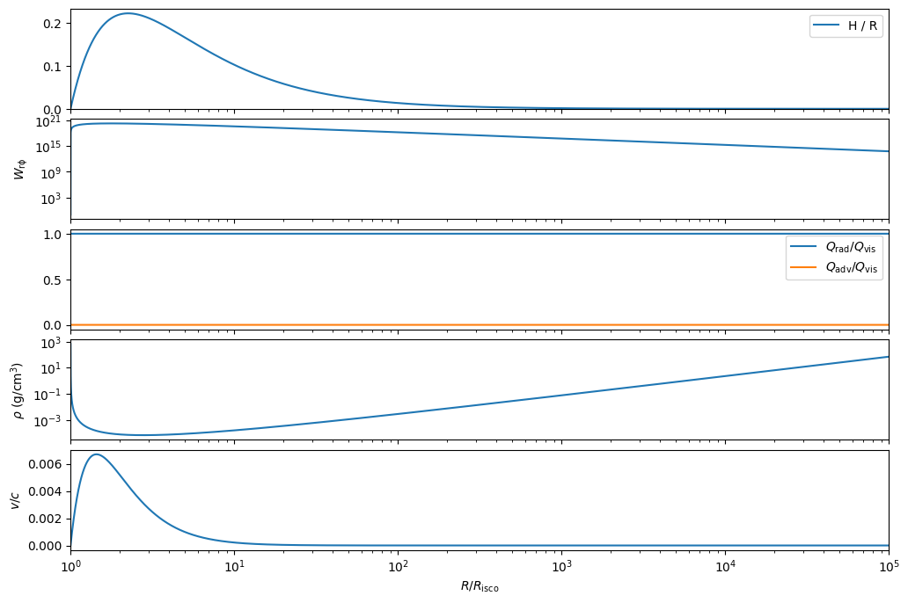
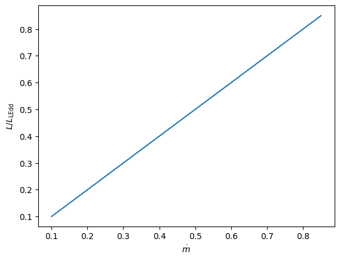
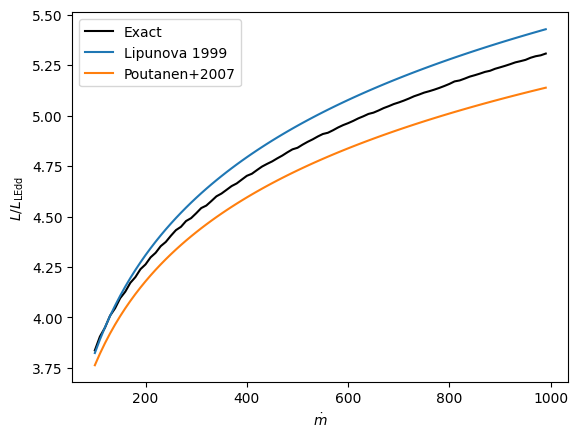
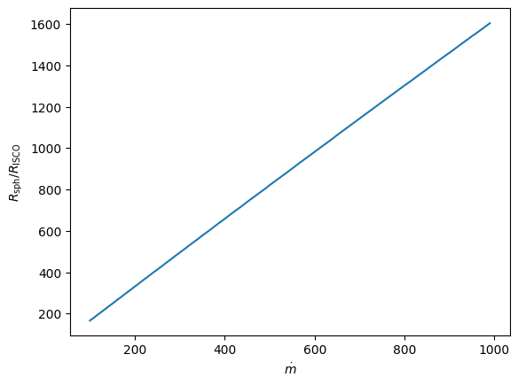

# Accretion disk solver
This code allows easy access to the disk Equations proposed by Lipunova+99 (which include the seminal thin-disk solution of Shakura & Sunyaev+1973). All disks are assumed to be optically thick and radiation-pressure suported.
The code solves the differential Equations for four types of disk:
- Conservative and non-advective disk (the analytical Shakura & Sunyaev 73 thin disk solution)
- Non-conservative and non-advective disk ("Slim" disk with Outflows, although it is solved numerically, an analytical solution exists as shown in Lipunova+99)
- Conservative and advective disk ("Slim" disk without outflows, no analytical solution exists, numerically solved)
- Non-conservative and advective disk ("Slim" advective disk with outflows, no analytical solution exists, numerically solved)

The code can be used to retrieve quantities of interest for observers such as the height, density, radial velocity, radiative output, etc.

The pdf in the docs folder shows the derivation of the final Equations that go into the solver.

## Installation

### Git Clone
To clone the repository, run the following command:
```bash
git clone https://github.com/andresgur/accretion-disks .
```

### Pip Install
Navigate to the cloned directory and install the package using pip:
```bash
cd accretion-disks
pip install .
```

## Usage
See the notebook in docs/examples.ipynb

``````python
from accretion_disks.shakurasunyaevdisk import ShakuraSunyaevDisk
from accretion_disks.diskwithoutflows import InnerDisk
from accretion_disks.basedisk import CompositeDisk
from accretion_disks.compact_object import CompactObject
import numpy as np
import matplotlib.pyplot as plt
```

## Define compact object


```python
co = CompactObject(10, a=0.5)
```

## SS73 disk (zona A i.e. radiation pressure dominated)


```python
disk = ShakuraSunyaevDisk(co, mdot=0.5, alpha=0.1, Wrphi_in=-0.1, N=100000)
fig, axes = disk.plot()

maxQ = np.argmax(disk.Qrad * disk.R**2)
print("Maximum energy released occurs at", f"{disk.R[maxQ] / disk.CO.Risco:.2f}", f"with H/R = {disk.H[maxQ]/disk.R[maxQ]:.2f}")

print(f"Total disk luminosity {disk.L() / co.LEdd:.2f} LEdd")
```

    Maximum energy released occurs at 2.25 with H/R = 0.22
    Total disk luminosity 0.50 LEdd


    

    


Parameters can be changed without rebuilding the disk


```python
# Standard disk luminosity is \propto \mdot
mdots = np.arange(0.1, 0.9, 0.05)
lums = np.empty(len(mdots), dtype=float)
for i, mdot in enumerate(mdots):
    disk.mdot = mdot
    lums[i] = disk.L()
plt.plot(mdots, lums / disk.CO.LEdd)
plt.xlabel(r"$\dot{m}$")  
plt.ylabel(r"$L/L_\mathrm{LEdd}$")
```


    Text(0, 0.5, '$L/L_\\mathrm{LEdd}$')


    

    


## Disk with Outflows from Lipunva 1999 (inner disk has mass loss, outer disk is modified SS733)

Rsph is defined as R such that L(R>Rsph) = LEdd


```python
disk = CompositeDisk(InnerDisk, ShakuraSunyaevDisk, CO=co, mdot=1000, alpha=0.1)
fig, axes = disk.plot()
print(f"Rsph = {disk.Rsph / disk.CO.Risco:.1f} x mdot")

maxQ = np.argmax(disk.Qrad * disk.R**2)
print("Maximum energy released occurs at", f"{disk.R[maxQ] / disk.CO.Risco:.1f}", f"with H/R = {disk.H[maxQ]/disk.R[maxQ]:.2f}")

print(f"Total disk luminosity {disk.L() / co.LEdd:.2f} LEdd")
# if we integrate the disk up to Rsph we find it is equal to LEdd, as expected
np.testing.assert_almost_equal(disk.L(Rmin=disk.Rsph) / co.LEdd, 1, decimal=1)
```

    Rsph = 1620.0 x mdot
    Maximum energy released occurs at 1620.5 with H/R = 0.62
    Total disk luminosity 5.31 LEdd


    

    


```python
def lipunova(mdot):
    return 0.6 + 0.7 * np.log(mdot)

def poutanen(mdot):
    return 1 + 3/5 * np.log(mdot)
```


```python
# Disk luminosity is \propto ln \mdot
# The dependency quoted by Lipunva (which is approximate) is shown by comparison
mdots = np.arange(100, 1000, 10)
lums = np.empty(len(mdots), dtype=float)
Rsphs = np.empty(len(mdots), dtype=float)
for i, mdot in enumerate(mdots):
    disk.mdot = mdot
    lums[i] = disk.L()
    Rsphs[i] = disk.Rsph
plt.plot(mdots, lums / disk.CO.LEdd, color="black", label="Exact")
plt.xlabel(r"$\dot{m}$")  
plt.plot(mdots, lipunova(mdots), label="Lipunova 1999")
plt.plot(mdots, poutanen(mdots), label="Poutanen+2007")
plt.ylabel(r"$L/L_\mathrm{LEdd}$")
plt.legend()


plt.figure()
plt.plot(mdots, Rsphs / disk.CO.Risco)
plt.xlabel(r"$\dot{m}$")  
plt.ylabel(r"$R_\mathrm{sph}/R_\mathrm{ISCO}$")
lipunovaRsph = 1.62
np.testing.assert_allclose(Rsphs / disk.CO.Risco / mdots, lipunovaRsph, rtol=1e-1)
```


    

    


    

    


```